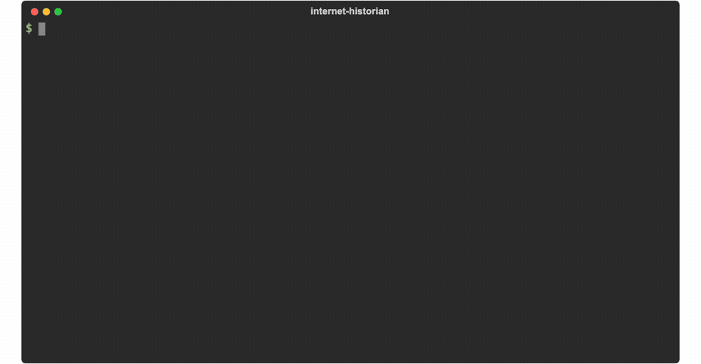
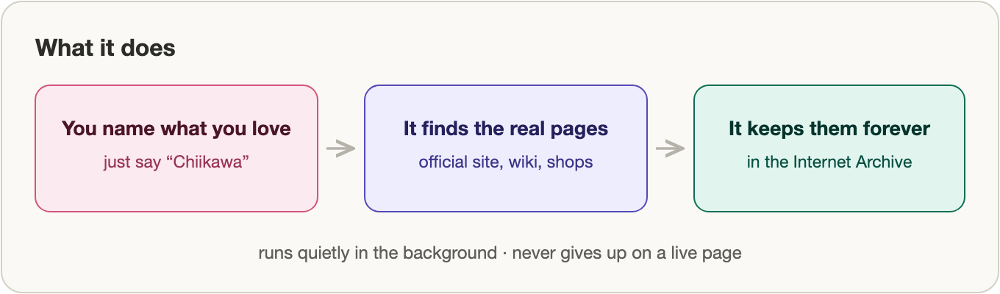
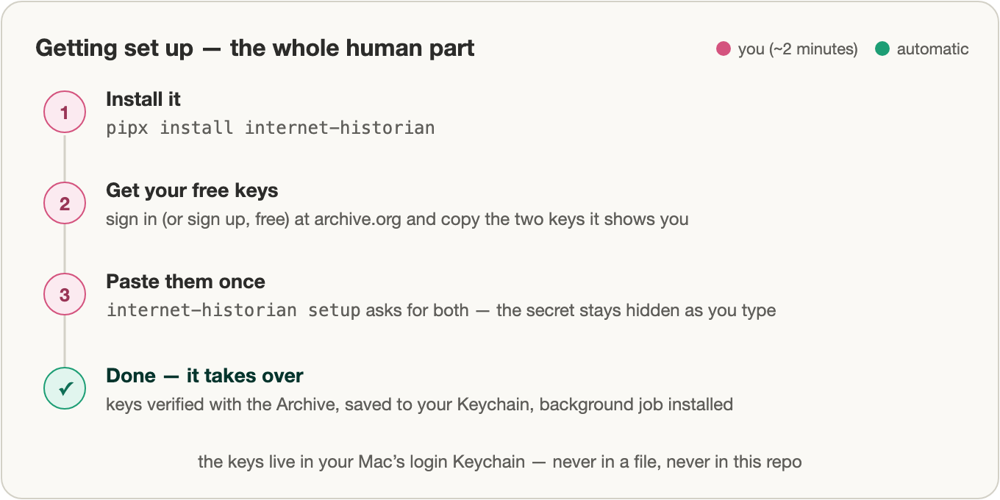
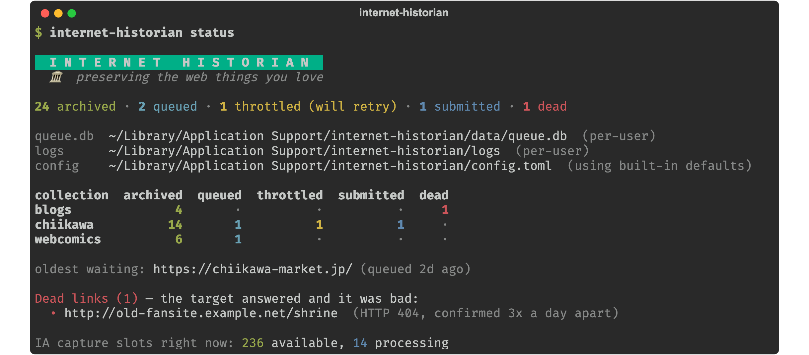
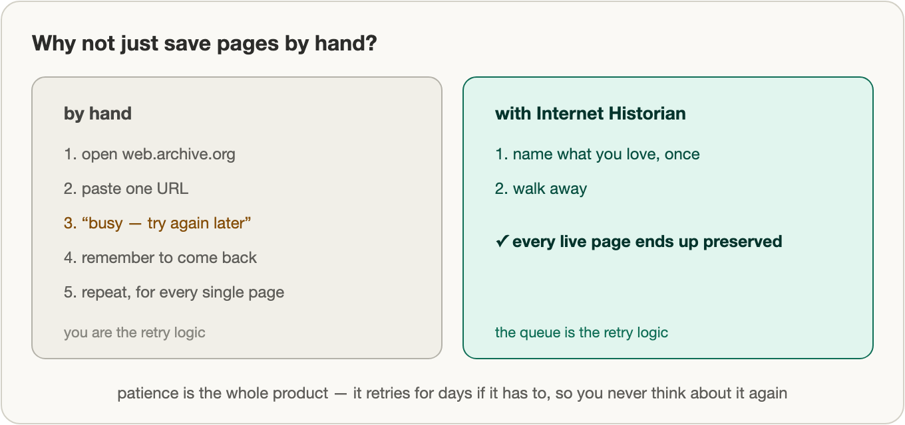

# Internet Historian 🏛️

[](https://github.com/ssskay/internet-historian/actions/workflows/test.yml)
[](https://pypi.org/project/internet-historian/)
[](https://pypi.org/project/internet-historian/)


**Quietly preserve the web things you love, forever.**



Internet Historian saves the web pages you care about into the free
[Internet Archive](https://web.archive.org/) and keeps trying until each one is safely tucked
away — then it re-checks nothing and bothers you about nothing. You point it at pages (or just
name a thing you love, and it finds the real pages for you); it runs by itself in the background
and makes sure those pages don't quietly disappear from the internet.



---

## Quickstart

Copy-paste this. Three lines and you're archiving:

```bash
pipx install internet-historian            # installs the `internet-historian` command onto your PATH
internet-historian setup                   # connects your free Archive account + starts the background job
internet-historian discover "Chiikawa"     # finds the real pages for a thing you love, and offers to save them
```

- **Line 1** installs the tool with [pipx](https://pipx.pypa.io/) (keeps it isolated; plain
  `pip install internet-historian` works too). You need **macOS**, **Python 3.11+**, and a free
  [archive.org](https://archive.org) account.
- **Line 2** walks you through getting your free API keys (it opens the right page), saves them
  to your macOS Keychain, and installs a `launchd` job that quietly does the archiving every 10
  minutes. You never run anything on a schedule yourself.
- **Line 3** is the fun part: type the name of anything — a show, a band, a webcomic, a fandom —
  and `discover` looks it up on Wikipedia/Wikidata, gathers its **official site, its Wikipedia
  article, and its real external links**, shows you the list, and queues the ones you pick. No
  account or API key needed for discovery; it's just Wikipedia.

Swap `"Chiikawa"` for whatever *you* want to keep. That's the whole setup — here it is as a picture:



Prefer to hand it exact links? `internet-historian add <url> <url> ...` works too (see the
[command reference](#command-reference)).

## Import your browser bookmarks

Already have a pile of links saved in your browser? Export them and hand the file over:

```bash
internet-historian add --bookmarks ~/Downloads/bookmarks.html
```

Every browser (Chrome, Firefox, Safari, Edge…) can **export bookmarks to an HTML file** —
that's the file you point at. Internet Historian reads it, skips anything it's already tracking,
tells you *"N new, M already tracked,"* and asks before queuing anything. Add `--folder "Name"`
to import just one bookmarks folder (and everything nested under it), and `--collection NAME` to
tag them:

```bash
internet-historian add --bookmarks ~/Downloads/bookmarks.html --folder "Keep forever" --collection keepers
```

## Prettier status (optional)

Install the `pretty` extra and `status` / `diagnose` render in color — a one-line summary, a
per-collection table with state chips, and a little header:

```bash
pipx install "internet-historian[pretty]"   # or, if already installed: pipx inject internet-historian rich
internet-historian status
```



It's purely cosmetic and completely optional — without `rich` installed, everything prints as
plain text exactly as before. No new required dependencies.

## If you use Claude Code

Internet Historian also grows a **natural-language interface** if you use
[Claude Code](https://claude.ai/code). Install the skill once:

```bash
internet-historian install-skill
```

Then, in any Claude Code session, just say what you want — no commands to remember:

> **You:** archive Chiikawa stuff
>
> **Claude:** *searches the web for the real, official ちいかわ pages, checks they're live,
> shows you the list, and queues them to a `chiikawa` collection — then the background job
> preserves them, patiently, on its own.*

> **You:** how's my archive doing?
>
> **Claude:** *reads back what's preserved, what's still queued, and anything that's stuck.*

> **You:** why hasn't that shop page saved yet?
>
> **Claude:** *tells you plainly: just throttled by a busy Archive (leave it — it'll retry) or a
> genuinely dead link.*

The skill just calls the same commands you could run yourself; it's a convenience, not a
requirement.

## Command reference

Every action is a plain CLI call. (A shorter `historian` alias is installed too.)

| Command | What it does |
|---------|--------------|
| `setup` | Connect your Archive account + install the background job (run once) |
| `discover "TERM" [--collection NAME]` | Find a subject's official/real pages via Wikipedia & Wikidata, then queue the ones you pick |
| `add URL [URL ...] [--collection NAME]` | Queue one or more URLs for preservation |
| `add --file urls.txt [--collection NAME]` | Queue a whole text file of URLs |
| `add --bookmarks export.html [--folder NAME] [--collection NAME]` | Import URLs from a browser's exported bookmarks HTML |
| `status` | See what's preserved, queued, or dead |
| `diagnose` | Plain-English "why isn't this archived yet?" — throttled vs. genuinely dead |
| `pause` / `resume` | Stop/restart a single URL or a whole `--collection` |
| `check` | Raw Internet Archive capacity right now |
| `install-skill` | Install the Claude Code skill into `~/.claude/skills` |

Collections are just tags — group your Chiikawa pages, your webcomics, your blogs. No setup needed.

## Why this exists

Web pages die. Fan sites go offline, shops close, links rot. The Internet Archive can preserve
almost any public page — but only if someone asks it to, at the right time, and keeps asking
when the Archive is too busy to answer. That "keep patiently asking" part is tedious to do by
hand. Internet Historian does it for you, forever, in the background.



It was built for one purpose: **saving [ちいかわ (Chiikawa)](https://en.wikipedia.org/wiki/Chiikawa)
pages before they vanish** — official sites, the anime, the shops, the wikis. But it works for
anything: a band, a webcomic, a favorite blog, a fandom, a single irreplaceable page.

> It optimizes for **never losing a URL**, not for speed. The Wayback Machine throttles when
> it's busy — Internet Historian treats that as normal weather, waits, and tries again. And
> again. For as long as it takes.

- 🗃️ **A patient queue, not a scraper.** Add URLs once; it preserves them and remembers what's done.
- 🔁 **Throttle-proof.** Built around the Internet Archive's real rate limits. Being throttled is expected, not an error.
- 💀 **Knows dead from busy.** A 404 or a vanished domain gets flagged as dead — but only after real confirmation. A busy Archive never counts against a page.
- 🔎 **Finds pages for you.** `discover` (and the Claude Code skill) turn a subject's name into its real, official pages — no manual link-hunting.
- 🔒 **Your keys stay yours.** API keys live in your macOS Keychain, never in this repo.

## How it works (the 60-second version)


- **`historian.py`** is the whole engine: a queue + an Internet Archive client, in one file.
- **`queue.db`** remembers every URL and its state (queued → submitted → archived / dead).
- **`launchd`** is the heartbeat: it runs `internet-historian drain` on a timer so you don't have to.
- Captures use server-side dedup (`if_not_archived_within=30d`), so already-saved pages aren't
  needlessly recaptured — they're just recorded as preserved.

Failures are classified carefully: rate-limits and timeouts retry forever with backoff; only a
page whose own server keeps answering badly (404, dead DNS, blocked) is marked dead, and only
after 3 confirmations spaced a day apart. Being throttled by a busy Archive **never** kills a URL.

### Polite by design

The Wayback Machine is free, shared infrastructure, so Internet Historian is built to be a
considerate guest — it stays well inside the Archive's real limits even though nobody's checking:


## What it does NOT do (by design, for now)

- **One backend: the Internet Archive.** No archive.today, no local copies yet. (Local
  snapshots via [`monolith`](https://github.com/Y2Z/monolith) are a planned future backend.)
- **No auto-discovery.** You add pages (or ask the skill to find them); it doesn't crawl the
  web hunting for new ones on its own.
- **Social media is best-effort.** X/Twitter and Instagram hide content behind login walls, so
  the Archive often captures a login page instead. Internet Historian will still try, but flags
  these — it's expected, not a bug.

## Related projects

Internet Historian's niche is being a **persistent, patient background queue** with a
**conversational control surface**: you add things once (or just ask the skill), and it keeps
working for weeks without you. Other excellent tools in this space, and how they differ:

- **[agude/wayback-machine-archiver](https://github.com/agude/wayback-machine-archiver)** — submits the URLs in a sitemap to the Wayback Machine. A one-shot batch script; no persistent queue, backoff, or state that survives between runs.
- **[overcast07/wayback-machine-spn-scripts](https://github.com/overcast07/wayback-machine-spn-scripts)** — capable Bash scripts around Save Page Now (outlinks, retries, cross-platform). You run and babysit a session; Internet Historian runs itself indefinitely via `launchd`.
- **[Mearman/mcp-wayback-machine](https://github.com/Mearman/mcp-wayback-machine)** — an MCP server exposing archive/retrieve/search as on-demand tool calls. Ideal for one-off actions inside an agent; it has no durable queue that keeps retrying throttled captures for you.
- **[internetarchive/internet-archive-skills](https://github.com/internetarchive/internet-archive-skills)** — the Internet Archive's official Claude Code skill for uploading, downloading, and searching archive.org *items*. Complementary: it manages Archive items, not patient web-page (SPN2) capture with backoff.
- **[bellingcat/auto-archiver](https://github.com/bellingcat/auto-archiver)** — heavy-duty archiving of links (including media) from a spreadsheet to many backends, built for OSINT/evidence workflows. Far more powerful, and far more to set up; Internet Historian is deliberately tiny, IA-only, and personal.

## Windows / Linux

*Officially* supported: not yet. *Actually usable today*: yes. The **engine** (`historian.py`:
the queue, the SQLite store, the Archive client) is pure Python and cross-platform — CI runs the
full test suite on Linux — and state already lands in the right place (XDG dirs on Linux,
`LOCALAPPDATA` on Windows). Only the two macOS conveniences are missing, and both have
one-line stand-ins:

```bash
# 1. Keys via environment variables instead of the macOS Keychain
#    (free keys: https://archive.org/account/s3.php)
export IA_ACCESS_KEY=<access> IA_SECRET_KEY=<secret>

# 2. Then everything works exactly as on macOS
internet-historian discover "Chiikawa"
internet-historian status

# 3. A timer instead of launchd — e.g. cron (crontab -e), every 10 minutes.
#    Use the full path from `which internet-historian`; cron's PATH is minimal.
IA_ACCESS_KEY=<access>
IA_SECRET_KEY=<secret>
*/10 * * * * $HOME/.local/bin/internet-historian drain
```

Running `setup` on a non-Mac prints exactly this recipe instead of failing confusingly. Making
it *native* is the whole to-do list, and each piece is a labeled starter issue:
[systemd timer backend (#1)](https://github.com/ssskay/internet-historian/issues/1),
[Windows Task Scheduler backend (#2)](https://github.com/ssskay/internet-historian/issues/2),
[cross-platform key storage via `keyring` (#3)](https://github.com/ssskay/internet-historian/issues/3).
**Contributions very welcome.**

## Configuration

Knobs live in [`config.toml`](config.toml) (no secrets there). Sensible defaults ship in the
box: 10-minute drain interval, 2 capture slots left free for your own browsing, 30-day dedup
window, and a conservative per-URL daily attempt cap. Tweak if you like; the defaults are fine.
Personal or machine-local settings can go in a `config.local.toml` next to it (gitignored) —
it's merged on top of `config.toml` at load time.

**Periodic recapture (opt-in).** By default a page is archived once and then left alone. To keep
a collection *fresh* — re-snapshotting pages that change over time, like a shop or a news hub —
give it a refresh window:

```toml
[collections]
chiikawa = { refresh_days = 30 }
```

Any archived page in that collection older than `refresh_days` is quietly re-queued on the next
drain; its last good snapshot stays on record until a new one lands. Collections you don't list
never recapture. The Internet Archive's own 30-day dedup still applies, so a very short
`refresh_days` just re-confirms the existing snapshot rather than spamming captures.

## License

[MIT](LICENSE) — do what you like. Preserve the web things *you* love.
